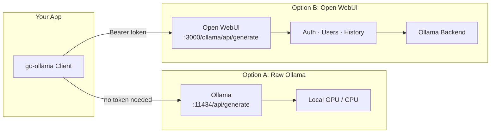
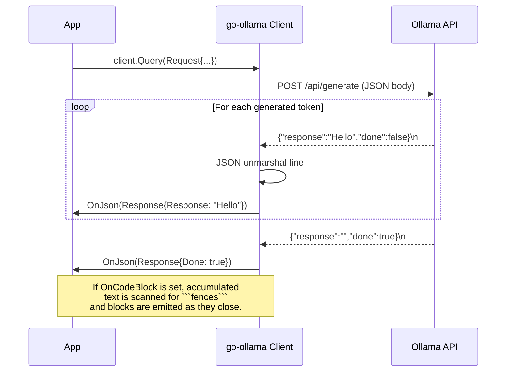
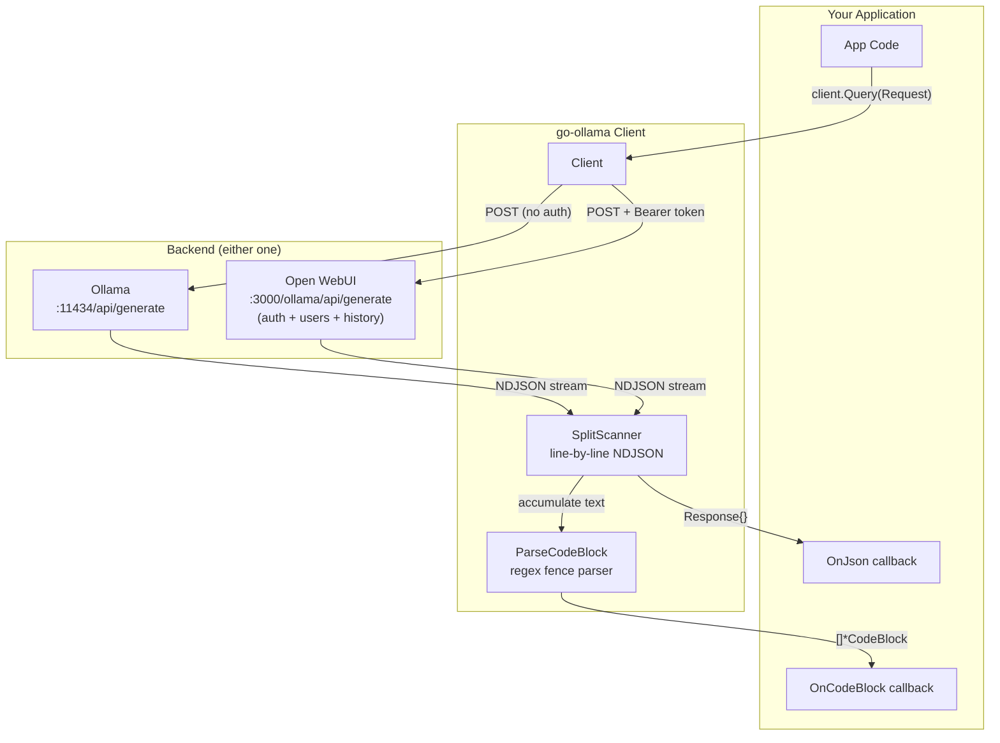

# go-ollama

[](https://github.com/eSlider/go-ollama/actions/workflows/ci.yml)
[](https://pkg.go.dev/github.com/eslider/go-ollama)
[](https://opensource.org/licenses/MIT)
[](https://go.dev)
[](https://github.com/eSlider/go-ollama/releases)
[](https://github.com/eSlider/go-ollama/stargazers)

Go client library for [Ollama](https://ollama.com/) and [Open WebUI](https://openwebui.com/) with streaming support. Works as an authenticated API client for both — connect directly to a local Ollama instance or to an Open WebUI deployment with user management, model access control, and shared conversations.

## Features

- **Dual backend** — works with both raw Ollama and Open WebUI (authenticated)
- **Bearer token auth** — required for Open WebUI, optional for local Ollama
- **Streaming responses** — real-time token-by-token processing via `OnJson` callback
- **Code block extraction** — automatically parses markdown code fences from AI output via `OnCodeBlock`
- Configurable model options (temperature, context size, GPU settings, etc.)
- Image support for multimodal models (base64-encoded)
- JSON output format support

## Installation

```bash
go get github.com/eslider/go-ollama
```

## Connecting to Ollama vs Open WebUI

The client works with two backends through the same API — the only difference is the URL and whether a token is needed:



### Direct Ollama (no auth)

Connect to a local Ollama instance — no token required:

```go
client := ollama.NewOpenWebUiClient(&ollama.DSN{
    URL: "http://localhost:11434/api/generate",
    // Token is empty — Ollama doesn't require auth by default
})
```

### Open WebUI (authenticated)

Connect to [Open WebUI](https://openwebui.com/), which wraps Ollama and adds user management, conversation history, model access control, and a web chat interface. The API requires a Bearer token — generate one in **Settings → Account → API Keys**:

```go
client := ollama.NewOpenWebUiClient(&ollama.DSN{
    URL:   "https://ai.example.com/ollama/api/generate",
    Token: "sk-xxxxxxxxxxxxxxxxxxxxxxxxxxxxxxxx",
})
```

Open WebUI benefits:
- **Multi-user access** — each user gets their own API key and conversation history
- **Model management** — admins control which models are available
- **Usage tracking** — monitor API usage per user/team
- **RAG pipelines** — attach documents for retrieval-augmented generation
- **Shared prompts** — team-wide prompt library

Both backends return the same NDJSON streaming format, so all `OnJson` and `OnCodeBlock` callbacks work identically regardless of which one you connect to.

## How Streaming Works

Ollama's `/api/generate` endpoint returns a **newline-delimited JSON stream** (NDJSON). Each line is a JSON object containing a fragment of the model's response — typically one or a few tokens at a time:



The client reads the HTTP response body line-by-line using a custom `SplitScanner`. Each line is unmarshaled into a `Response` struct and delivered to your `OnJson` callback **as it arrives** — no buffering, no waiting for the full response. This gives your application real-time, token-by-token output similar to WebSocket streaming.

When the model finishes, it sends a final JSON line with `"done": true`.

## Usage

### Basic Streaming with `OnJson`

The `OnJson` callback fires once per streamed JSON line. Each `Response` carries a fragment of text in the `Response` field, a timestamp, the model name, and a `Done` flag:

```go
client := ollama.NewOpenWebUiClient(&ollama.DSN{
    URL:   os.Getenv("OPEN_WEB_API_GENERATE_URL"),
    Token: os.Getenv("OPEN_WEB_API_TOKEN"),
})

err := client.Query(ollama.Request{
    Model:  "llama3.2:3b",
    Prompt: "Explain goroutines in 3 sentences",
    Options: &ollama.RequestOptions{
        Temperature: ollama.Float(0.7),
    },
    OnJson: func(res ollama.Response) error {
        // Print each token as it arrives — real-time streaming output
        if res.Response != nil {
            fmt.Print(*res.Response)
        }
        // Detect when the model finishes
        if res.Done != nil && *res.Done {
            fmt.Println("\n--- generation complete ---")
        }
        return nil
    },
})
```

**Use cases for `OnJson`:**

| Use case | How |
|---|---|
| Live terminal output | Print each `*res.Response` as it arrives |
| Progress indicator | Count callbacks to show a spinner or token counter |
| Token accumulation | Append `*res.Response` to a `strings.Builder` for the full text |
| Early stop | Return an error from the callback to abort the stream |
| Metadata inspection | Read `res.Model`, `res.CreatedAt` for logging/metrics |
| Chat UI streaming | Push each token to a WebSocket/SSE for browser display |

### Accumulating the Full Response

```go
var full strings.Builder

err := client.Query(ollama.Request{
    Model:  "llama3.2:3b",
    Prompt: "Write a haiku about Go",
    OnJson: func(res ollama.Response) error {
        if res.Response != nil {
            full.WriteString(*res.Response)
        }
        return nil
    },
})

fmt.Println(full.String())
```

### Early Stop

Return an error from `OnJson` to immediately abort the stream. Useful for content filtering, token limits, or timeout logic:

```go
var tokenCount int

err := client.Query(ollama.Request{
    Model:  "llama3.2:3b",
    Prompt: "Tell me a very long story",
    OnJson: func(res ollama.Response) error {
        tokenCount++
        if tokenCount > 100 {
            return fmt.Errorf("token limit reached")
        }
        fmt.Print(*res.Response)
        return nil
    },
})
// err will contain "token limit reached"
```

## Code Block Extraction with `OnCodeBlock`

When set, `OnCodeBlock` scans the accumulated streamed text for markdown code fences (` ```lang ... ``` `) and delivers parsed blocks as soon as they close. The library handles the incremental accumulation — you receive complete, ready-to-use code:

```go
err := client.Query(ollama.Request{
    Model:  "llama3.2:3b",
    Prompt: "Write a Go HTTP server and a Dockerfile for it",
    OnCodeBlock: func(blocks []*ollama.CodeBlock) error {
        for _, block := range blocks {
            fmt.Printf("=== %s ===\n%s\n\n", block.Type, block.Code)
        }
        return nil
    },
})
```

Each `CodeBlock` has:

| Field | Type | Description |
|---|---|---|
| `Type` | `string` | Language from the fence (e.g. `"go"`, `"python"`, `"bash"`, `"sql"`) |
| `Code` | `string` | The raw code content between the fences |

**Use cases for `OnCodeBlock`:**

| Use case | How |
|---|---|
| Code generation pipeline | Extract code, write to files, compile/run |
| AI-powered refactoring | Parse the generated code block and apply as a patch |
| Multi-file scaffolding | Request multiple files, each in its own fence, route by `Type` |
| Syntax highlighting | Feed `Code` to a highlighter with `Type` as the language hint |
| Test generation | Extract test code blocks and run them automatically |
| Documentation extraction | Pull SQL, config, or shell snippets from AI explanations |

### Using Both Callbacks Together

`OnJson` and `OnCodeBlock` can work simultaneously — stream output to the terminal while also capturing structured code:

```go
var codeBlocks []*ollama.CodeBlock

err := client.Query(ollama.Request{
    Model:  "llama3.2:3b",
    Prompt: "Write a REST API in Go with a Makefile",
    OnJson: func(res ollama.Response) error {
        if res.Response != nil {
            fmt.Print(*res.Response) // Live terminal output
        }
        return nil
    },
    OnCodeBlock: func(blocks []*ollama.CodeBlock) error {
        codeBlocks = append(codeBlocks, blocks...)
        return nil
    },
})

// After completion, process extracted code
for _, block := range codeBlocks {
    fmt.Printf("\nExtracted [%s]: %d bytes\n", block.Type, len(block.Code))
}
```

### JSON Output Format

Force the model to return valid JSON by setting `Format`:

```go
f := ollama.FormatJson
err := client.Query(ollama.Request{
    Model:  "llama3.2:3b",
    Prompt: `Return a JSON object with fields "name" and "age" for a fictional person`,
    Format: &f,
    Options: &ollama.RequestOptions{
        Temperature: ollama.Float(0),
    },
    OnJson: func(res ollama.Response) error {
        if res.Response != nil {
            fmt.Print(*res.Response)
        }
        return nil
    },
})
```

### Image Analysis (Multimodal)

Send images to vision models for analysis:

```go
imageData, _ := os.ReadFile("photo.jpg")

err := client.Query(ollama.Request{
    Model:  "x/llama3.2-vision",
    Prompt: "Describe what you see in this image",
    Images: []ollama.RequestImage{imageData},
    OnJson: func(res ollama.Response) error {
        if res.Response != nil {
            fmt.Print(*res.Response)
        }
        return nil
    },
})
```

## Architecture



## Environment Variables

| Variable | Description | Example |
|---|---|---|
| `OPEN_WEB_API_GENERATE_URL` | API endpoint URL | `http://localhost:11434/api/generate` (Ollama) or `https://ai.example.com/ollama/api/generate` (Open WebUI) |
| `OPEN_WEB_API_TOKEN` | Bearer token | Empty for local Ollama, required for Open WebUI (`sk-...`) |

## Testing

The library includes comprehensive mock tests that simulate Ollama's streaming API using `httptest.Server` — no live Ollama instance required:

```bash
go test -v -race ./...
```

### Test Coverage

| Area | Tests | What's verified |
|---|---|---|
| **Stream processing** | `TestQueryStream_TokenByToken`, `_OnJsonDoneFlag` | Token-by-token delivery, done flag transitions |
| **OnJson callback** | `_OnJsonReceivesModel`, `_OnJsonError` | Model metadata, error propagation stops stream |
| **Code block extraction** | `_CodeBlockExtraction`, `_MultipleCodeBlocks` | Single/multi block parsing from stream |
| **OnCodeBlock callback** | `_OnCodeBlockError`, `_BothCallbacks` | Error handling, simultaneous OnJson+OnCodeBlock |
| **HTTP layer** | `_AuthorizationHeader`, `_HTTPError`, `_RequestJSON` | Auth header, error status codes, request serialization |
| **Scanner** | `_NewlineDelimited`, `_CustomDelimiter`, `_JSONLines` | NDJSON splitting, custom delimiters |
| **Parser** | `_SingleBlock` through `_SQL` | Regex parsing for go, python, bash, js, sql fences |
| **Helpers** | `TestConvertHelpers`, `TestRequestToJson` | Pointer helpers, JSON serialization |

## API Reference

### Types

| Type | Description |
|---|---|
| `Client` | HTTP client with auth for Ollama API |
| `DSN` | Connection config (URL + token) |
| `Request` | Query parameters: model, prompt, options, callbacks |
| `Response` | Streamed JSON fragment: model, text, done flag, timestamp |
| `RequestOptions` | Model tuning: temperature, context size, top-k/p, GPU, etc. |
| `CodeBlock` | Parsed code fence with `Type` (language) and `Code` (content) |

### Functions

| Function | Description |
|---|---|
| `NewOpenWebUiClient(dsn)` | Create authenticated client |
| `client.Query(request)` | Send prompt, stream response through callbacks |
| `ParseCodeBlock(text)` | Extract code fences from markdown text |
| `NewSplitScanner(body, sep)` | Create line-by-line scanner for NDJSON |
| `OpenFileDescriptor(path)` | Create/open file with auto-mkdir |

### Pointer Helpers

| Helper | Description |
|---|---|
| `Int(i)` | `*int` from `int` |
| `Float(f)` | `*float64` from `float64` |
| `String(s)` | `*string` from `string` |
| `Bool(b)` | `*bool` from `bool` |

## Related

- [ollama-intel-gpu](https://github.com/eSlider/ollama-intel-gpu) — Run Ollama on Intel GPUs (Arc, iGPU, Flex/Max)
- [go-matrix-bot](https://github.com/eSlider/go-matrix-bot) — Matrix bot using go-ollama for AI features
- [go-trade](https://github.com/eSlider/go-trade) — Unified market data model
- [go-onlyoffice](https://github.com/eSlider/go-onlyoffice) — OnlyOffice Project Management API

## License

[MIT](LICENSE)
